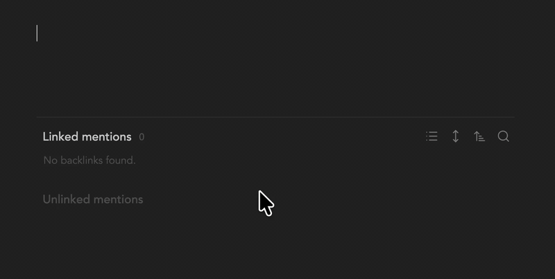

# Paste Link As

[English](README.md) | [한국어](README.ko.md) | [简体中文](README.zh-CN.md) | [日本語](README.ja.md) | [Español](README.es.md) | **Français**

Collez une URL et choisissez sa forme dans votre note : un lien avec titre, une mention en ligne ou une carte de lien. Tout est écrit en Markdown standard, vos notes restent donc lisibles sans le plugin.


## Fonctionnement

Collez une URL dans une note. Elle est insérée aussitôt sous la forme `[Titre](url)`, et un petit menu s'ouvre en dessous :

- **Garder** : reste un lien avec titre.
- **Mention** : favicon, nom du site et titre sur une ligne, raccourcie par … si elle est trop longue.
- **Carte** : miniature, titre, description sur deux lignes, et le favicon avec l'adresse du lien.

Utilisez ↑/↓ et Entrée (ou Tab) pour choisir, et Échap pour fermer. Pour ignorer le menu, continuez simplement à écrire ; Entrée sur **Garder** crée une nouvelle ligne comme d'habitude.



[Voir la démo en MP4](screenshot/sample2.mp4)

Vous pouvez aussi convertir une URL déjà présente dans une note. Sélectionnez-la (une URL seule ou un lien `[Titre](url)`) et lancez une commande :

- **Transformer le lien en carte**
- **Transformer le lien en mention**

Sans sélection, les commandes utilisent l'URL du presse-papiers, ou vous la demandent. Le plugin ne définit aucun raccourci par défaut ; attribuez les vôtres dans les paramètres d'Obsidian.

Le menu, les commandes et les paramètres suivent la langue d'Obsidian : anglais, coréen, chinois simplifié, japonais, espagnol ou français. Le chinois traditionnel utilise le chinois simplifié, et toute autre langue utilise l'anglais.

## Ce qui est écrit

**Garder** laisse un lien avec titre :

```md
[The Odyssey | Official Trailer](https://www.youtube.com/watch?v=Mzw2ttJD2qQ)
```

Une mention est un lien Markdown classique. Pour une vidéo YouTube, le nom du site est le nom de la chaîne :

```md
[ *Nom de la chaîne* The Odyssey | Official Trailer](https://www.youtube.com/watch?v=Mzw2ttJD2qQ)
```

Une carte est un callout `[!link]` :

```md
> [!link] [The Odyssey | Official Trailer](https://www.youtube.com/watch?v=Mzw2ttJD2qQ)
> ![[link-youtube.com-h5vbt4.jpg]]
>
> The Odyssey - In Theaters 07.17.26…
>
> ![[favicon-youtube.com.png|16]] https://www.youtube.com/watch?v=Mzw2ttJD2qQ
```

Aucune syntaxe propre au plugin. Plugin désactivé, une mention s'affiche comme un lien classique et une carte comme un callout classique ; seul le style disparaît.

Un clic n'importe où sur une carte ou une mention ouvre le lien. Pour modifier une carte en aperçu en direct, placez-y le curseur depuis la ligne du dessous.

## Quand le collage n'est pas modifié

Le menu ne s'ouvre pas, et le collage se fait normalement, lorsque :

- le presse-papiers contient autre chose qu'une seule URL, ou une URL d'image ;
- vous collez dans la cible d'un lien (`](`), juste après un guillemet, `<` ou `[`, dans du code ou dans les propriétés ;
- vous êtes hors ligne.

Coller une URL sur du texte sélectionné transforme ce texte en lien : `[texte sélectionné](url)`.

Dans les listes, les citations et les tableaux, le menu n'a pas d'option **Carte**, car une carte est un callout sur plusieurs lignes.

## Paramètres

- **Dossier des images** : emplacement des miniatures et des favicons. Laissez vide pour utiliser l'emplacement des pièces jointes défini dans les paramètres d'Obsidian.

## Utilisation du réseau

Quand vous collez une URL ou lancez une commande, le plugin demande la page directement à son propre site pour lire le titre, la description, l'image et le favicon. Pour les cartes et les mentions, il télécharge l'image et le favicon depuis ce site et les enregistre dans votre coffre. Aucun autre service distant n'est contacté, rien de vos notes n'est envoyé ailleurs, et il n'y a aucune télémétrie.

## Fichiers enregistrés

- Favicons : `favicon-<domaine>.<ext>`, un par domaine. Les formats qu'Obsidian ne sait pas afficher, comme `.ico`, sont convertis en PNG.
- Miniatures : `link-<domaine>-<hash>.<ext>`.

Les fichiers existants sont réutilisés : coller un autre lien du même site ne retélécharge pas son favicon.

## Style

`styles.css` ne cible que les cartes (callouts `[!link]`) et les mentions (un lien contenant une image de 16 px et un nom de site en italique). Les autres liens et images gardent l'apparence de votre thème. Pour ajuster l'apparence, surchargez ces sélecteurs dans un extrait CSS.

La graisse des titres vient de `--paste-link-as-title-weight` (500 par défaut). Pour la modifier, ajoutez un extrait CSS comme `body { --paste-link-as-title-weight: 600; }`.

## Limites

- Tant que le menu est ouvert, ↑/↓ se déplacent dans le menu. Appuyez d'abord sur Échap pour déplacer le curseur.
- En aperçu en direct, une ligne contenant une mention reste sur une seule ligne, terminée par …, tant que le curseur n'y est pas. Le reste du texte de cette ligne est aussi raccourci.
- Un lien contenant une image de 16 px de large et du texte en italique est stylé comme une mention, et un callout de type `link` comme une carte.
- Les plugins qui réécrivent aussi les URL collées, comme Auto Link Title, traitent le même événement de collage. Désactivez leur gestion du collage pour qu'un collage ne soit pas traité deux fois.

## Installation

- **Plugins communautaires** : cherchez « Paste Link As » dans les plugins communautaires d'Obsidian (une fois publié).
- **Manuellement** : téléchargez `main.js`, `manifest.json` et `styles.css` depuis la dernière version dans `<coffre>/.obsidian/plugins/paste-link-as/`, rechargez Obsidian et activez le plugin.

## Licence

[MIT](LICENSE)
