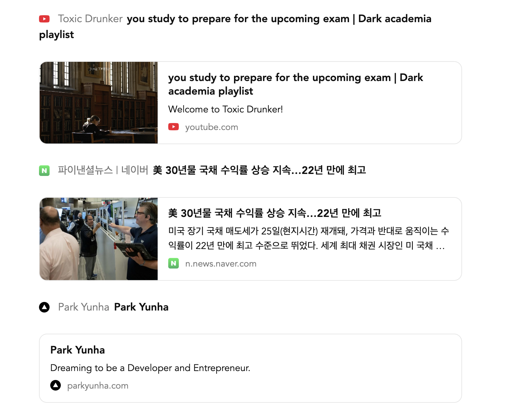
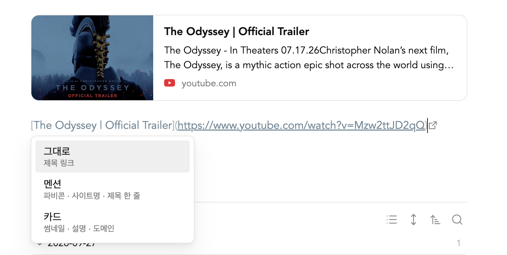

# Paste Link As

Paste a URL and choose how it lands in your note: a titled link, an inline mention, or a link card. Everything is written as plain Markdown, so your notes stay readable without the plugin.



## How it works

Paste a URL into a note. It goes in as `[Title](url)` right away, and a small menu opens under it:

- **Keep**: stays a titled link.
- **Mention**: favicon, site name and title on one line.
- **Card**: thumbnail, title, a two-line description, and the favicon with the domain.

Use ↑/↓ and Enter (or Tab) to pick, and Esc to close. To ignore the menu, just keep typing; Enter on **Keep** starts a new line as usual.



You can also convert a URL that is already in a note. Select it (a bare URL or a `[Title](url)` link) and run a command:

- **Turn link into card**
- **Turn link into mention**

With nothing selected, the commands use the URL on the clipboard, or ask for one. The plugin sets no default hotkeys; assign your own in **Settings → Hotkeys**.

The menu and commands follow Obsidian's language: English, or Korean when Obsidian is set to Korean.

## What gets written

**Keep** leaves a titled link:

```md
[The Odyssey | Official Trailer](https://www.youtube.com/watch?v=Mzw2ttJD2qQ)
```

A mention is a regular Markdown link. For a YouTube video, the site name is the channel name:

```md
[ *Channel name* The Odyssey | Official Trailer](https://www.youtube.com/watch?v=Mzw2ttJD2qQ)
```

A card is a `[!link]` callout:

```md
> [!link] [The Odyssey | Official Trailer](https://www.youtube.com/watch?v=Mzw2ttJD2qQ)
> ![[link-youtube.com-h5vbt4.jpg]]
>
> The Odyssey - In Theaters 07.17.26…
>
> ![[favicon-youtube.com.png|16]] youtube.com
```

There is no plugin-specific syntax. With the plugin turned off, a mention shows as a normal link and a card as a normal callout; only the styling goes away.

Clicking anywhere on a card or a mention opens the link. To edit a card in Live Preview, move the cursor into it from the line below.

## When a paste is left alone

The menu doesn't open, and the paste works as usual, when:

- the clipboard holds anything other than a single URL, or an image URL;
- you paste inside a link target (`](`), right after a quote, `<` or `[`, inside code, or in the properties;
- you're offline.

Pasting a URL over selected text links that text: `[selected text](url)`.

Inside lists, blockquotes and tables the menu has no **Card** option, since a card is a multi-line callout.

## Settings

- **Image folder**: where thumbnails and favicons are saved. Leave it empty to use the attachment location from Obsidian's settings.

## Network use

When you paste a URL or run a command, the plugin requests that page directly from its own site to read the title, description, image and favicon. For cards and mentions it downloads the image and the favicon from that site and saves them in your vault. No other remote service is contacted, nothing from your notes is sent anywhere, and there is no telemetry.

## Saved files

- Favicons: `favicon-<domain>.<ext>`, one per domain. Formats Obsidian can't display, such as `.ico`, are converted to PNG.
- Thumbnails: `link-<domain>-<hash>.<ext>`.

Existing files are reused, so pasting another link from the same site doesn't download its favicon again.

## Styling

`styles.css` only matches cards (`[!link]` callouts) and mentions (a link that holds a 16px image and an italic site name). Other links and images keep your theme's look. To adjust the look, override these selectors in a CSS snippet.

## Limitations

- While the menu is open, ↑/↓ move inside the menu. Press Esc first to move the cursor.
- A link that holds a 16px-wide image and italic text is styled as a mention, and a callout of type `link` as a card.
- Plugins that also rewrite pasted URLs, such as Auto Link Title, handle the same paste event. Turn off their paste handling so that one paste isn't handled twice.

## Installation

- **Community plugins**: Settings → Community plugins → Browse, then search for "Paste Link As" (once it is listed).
- **Manually**: download `main.js`, `manifest.json` and `styles.css` from the latest release into `<vault>/.obsidian/plugins/paste-link-as/`, reload Obsidian, and enable the plugin.

## License

[MIT](LICENSE)
